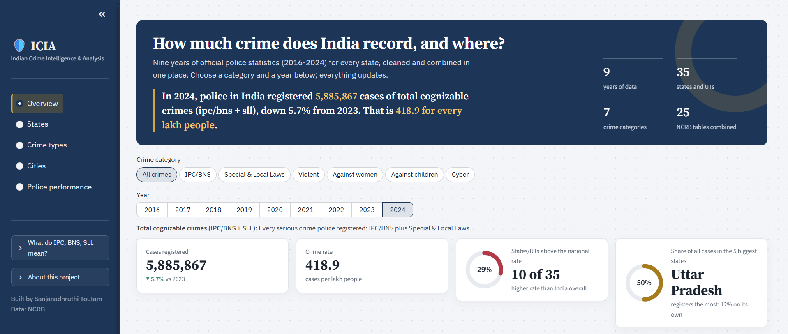
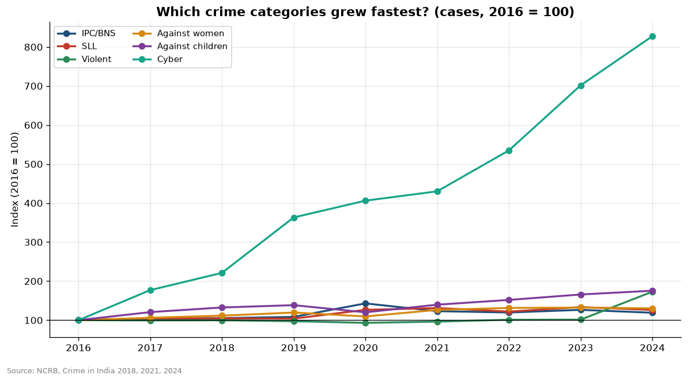

# 🛡️ ICIA — Indian Crime Intelligence & Analysis

**Nine years of official Indian crime statistics (2016–2024), cleaned, combined and made explorable.**

🔗 **Live dashboard:** _coming soon_ &nbsp;·&nbsp; 📊 Data: NCRB *Crime in India* &nbsp;·&nbsp; 🐍 Python · SQL · Streamlit



---

## Why this project exists

The National Crime Records Bureau (NCRB) publishes *Crime in India* every year, but as hundreds of
separate, static tables whose layouts change between editions. Simple questions are painful to answer:
*Which state's crime against women grew fastest? Which cities are outliers? Did the new criminal code change anything?*

ICIA turns 25 of those tables into **one consistent database** and puts trends, state comparisons,
city analysis, police performance and automatic anomaly detection on top of it.

**Who it helps:** journalists and researchers who need reliable comparisons, policy and planning teams
deciding where resources go, and citizens who want to understand their own state.

## Key findings

| | Finding |
|---|---|
| 📈 | Total recorded crime rose from **48.3 lakh cases (2016) to 58.9 lakh (2024)**, +21.8%. The crime rate went from 373 to 419 per lakh people. |
| 🦠 | **2020 peaked at 66.0 lakh cases** (+28% in one year): COVID-19 lockdown violations were registered as criminal cases, a registration effect rather than a crime wave. |
| 💻 | **Cyber crime grew +727%** since 2016, by far the fastest category. Crimes against children grew +75%. |
| 🗺️ | **Uttar Pradesh registers the most cases, but Kerala has the highest rate.** Only 7 states appear in both top-10 lists: raw counts mostly reflect population size. |
| ⚖️ | **46.3% of 2024 IPC/BNS cases** were registered under the new Bharatiya Nyaya Sanhita, which only applied from 1 July 2024. |
| 🏙️ | Among metros, **Delhi City has the highest crime rate (1,824 per lakh)** and Kolkata the lowest (94). |
| ⚠️ | The anomaly detector flagged **45 unusual state-years** without being told about any events, including the **2023 Manipur violence** (violent crime +2,186%) and **Tamil Nadu's 2020 lockdown cases** (+430%). |

> **Read with care:** these are *recorded* crimes. Easier reporting (online FIRs, cyber helplines) raises
> the numbers without more crime actually happening. A high rate is not automatically a less safe state.



## What makes the data trustworthy

Every run of the pipeline checks itself:

- ✅ **State rows add up to NCRB's own All-India total** in every file and every year.
- ✅ **IPC + SLL matches NCRB's published total** exactly for 2022–2024, so totals derived for 2016–2021 can be trusted.
- ✅ **640 of 640** crime rates calculated by ICIA match the rates NCRB printed.
- ✅ National totals match NCRB's published figures for 2024 (58,85,867 cases, rate 418.9).

## The hard parts (and how they were solved)

| Problem | Solution |
|---|---|
| Raw tables have title rows, footnotes, merged headers and side-by-side "continued" pages | A parser that finds the real header rows, years and data rows in each file |
| **Boundary changes:** Ladakh split from J&K (2019); Dadra & Nagar Haveli merged with Daman & Diu (2020) | Harmonised to **35 consistent areas** so trends stay comparable across all 9 years |
| **IPC → BNS** (1 July 2024): the 2024 tables split cases between two laws | IPC and BNS columns combined; the split analysed separately |
| Population only published for 2018, 2021 and 2024 | Interpolated for every year; women and children use their own population base |
| Crime-head tables are **nested** (Theft contains Vehicle Theft) | Only main heads are ranked, to avoid double counting |
| National rate | Total cases ÷ total population, **not** an average of state rates |

## Tech stack

**Python** (pandas, NumPy) · **SQL** (SQLite, star schema, views, window functions) · **SQLAlchemy** ·
**Plotly** & **Matplotlib** · **Streamlit** · Git

## How it works

```
25 raw NCRB tables (.xlsx/.csv)
        │  cleaning.py         parse messy report tables into tidy rows
        ▼
data/processed/*.csv
        │  transformation.py   harmonise states, derive totals, compute rates
        ▼
SQLite database            star schema: fact_crime + dim_state + dim_category
        │  views.sql           national trend, rankings, zone trend, BNS split
        ▼
analysis (13 charts + written insights)   →   Streamlit dashboard
```

## Run it yourself

```bash
git clone https://github.com/sanjanadhruthi/ICIA.git
cd ICIA
python -m venv venv
venv\Scripts\activate            # Windows  (macOS/Linux: source venv/bin/activate)
python -m pip install -r requirements.txt

python main.py                   # rebuilds everything from the raw files in ~20 seconds
streamlit run dashboard/app.py   # opens the dashboard
```

## Project structure

```
ICIA/
├── data/
│   ├── raw/              25 NCRB tables (see data/README.md)
│   └── processed/        clean CSVs produced by the pipeline
├── sql/                  schema.sql, views.sql, analysis_queries.sql
├── src/
│   ├── preprocessing/    cleaning.py, transformation.py
│   ├── database/         connection, create_tables, load_data
│   ├── analysis/         trends, states, categories, cities, anomalies
│   └── utils/            config, logger
├── dashboard/app.py      Streamlit dashboard
├── reports/              figures/ (charts) and insights/ (written findings)
├── tests/
└── main.py               runs the whole pipeline
```

## Limitations

- NCRB data is **annual**: this is a refreshable pipeline, not real-time monitoring.
- Detailed crime-head and city data cover **2022–2024** only.
- City crime rates use **2011 census** population (NCRB's method), so fast-growing cities look worse than they are.
- 2024 violent-crime figures jump sharply in NCRB's own tables, likely linked to BNS reclassification; flagged on the dashboard.

## Author

**Sanjanadhruthi Toutam** · B.Tech Information Technology, CBIT Hyderabad
GitHub: [@sanjanadhruthi](https://github.com/sanjanadhruthi)

*Data: National Crime Records Bureau, Ministry of Home Affairs, Government of India. Licensed under MIT.*