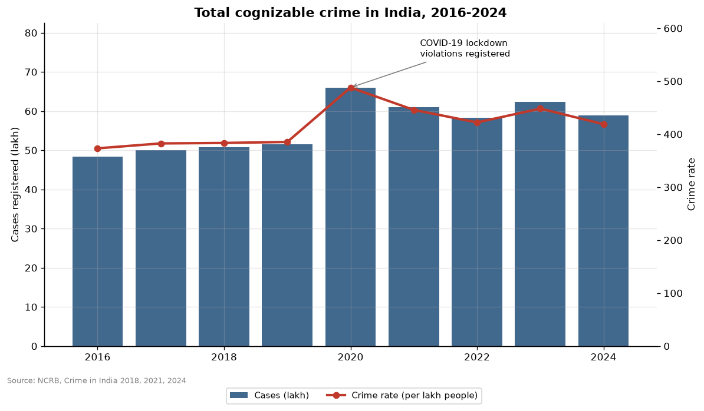
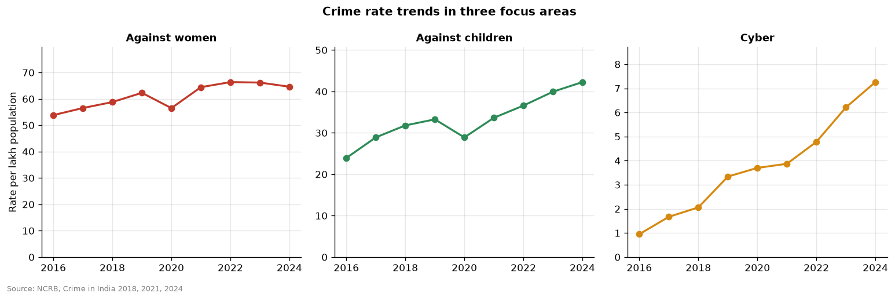

# National crime trends (2016-2024)

- Total cognizable crime went from 48.3 lakh cases (2016) to 58.9 lakh (2024), a change of +21.8%. The crime rate moved from 373.3 to 418.9 per lakh people.
- 2020 was the peak year (66.0 lakh cases, +28.0% vs 2019). This spike reflects COVID-19 lockdown violations being registered as cases, not a rise in conventional crime.
- Fastest-growing category 2016-2024: Cyber (+727.5% cases). Against children +75%, Violent +73%, Against women +30%, SLL +26%, IPC/BNS +19%.
- Caution: rising numbers can also mean better reporting (e.g. online FIRs, cyber helplines), not only more crime.

## Charts

