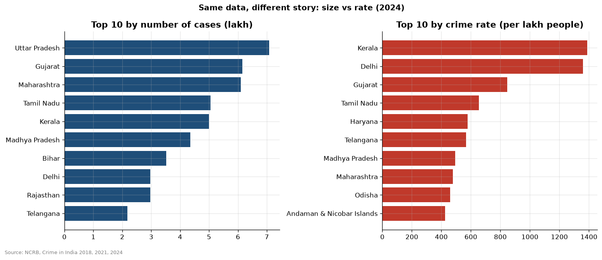
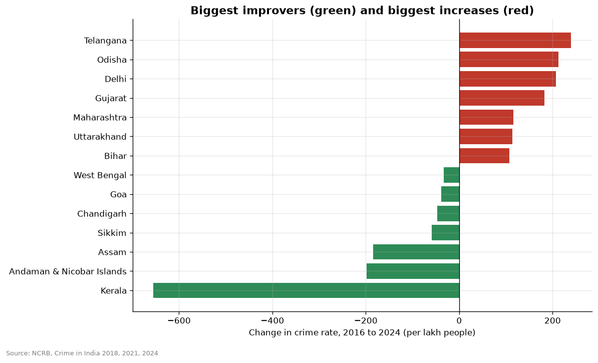
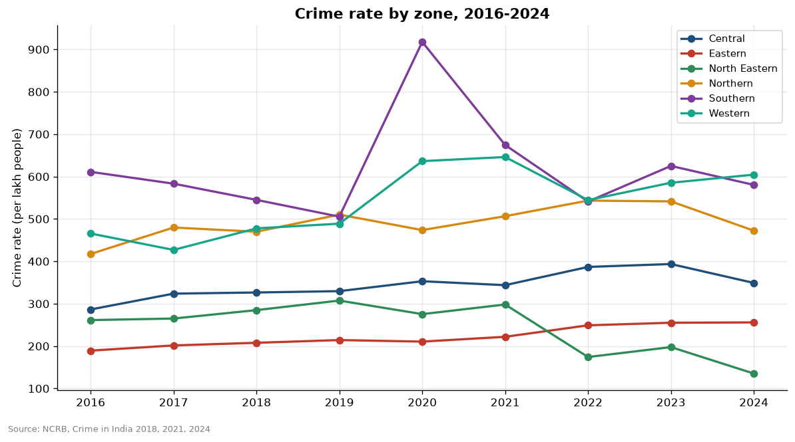

# State-level analysis

- In 2024, Uttar Pradesh registered the most cases (7.1 lakh), but Kerala had the highest crime rate (1389 per lakh). Only 7 states appear in both top-10 lists: raw counts mostly reflect population size.
- Biggest improvement 2016-2024: Kerala (rate 2044 -> 1389). Biggest increase: Telangana (rate 329 -> 569).
- Highest-rate zone in 2024: Western (605); lowest: North Eastern (135).
- Chargesheeting rate 2024 ranges from 18.0% (Manipur) to 97.7% (Kerala).
- High crime rates can partly reflect easier registration of FIRs, so a high rate is not automatically a sign of a less safe state.

## Charts

