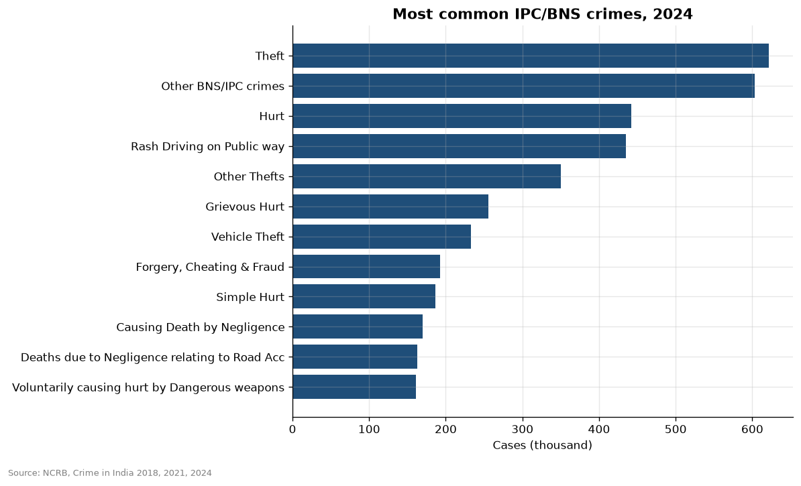
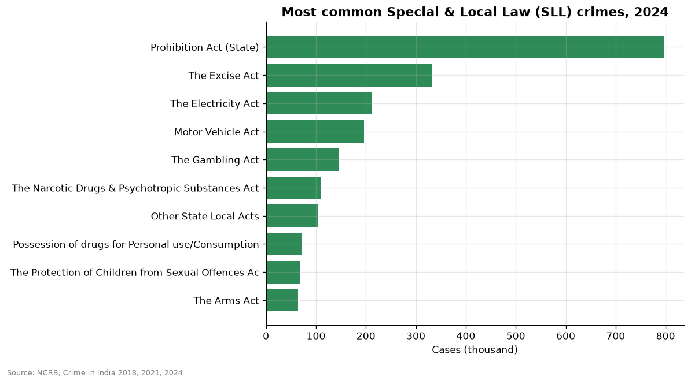
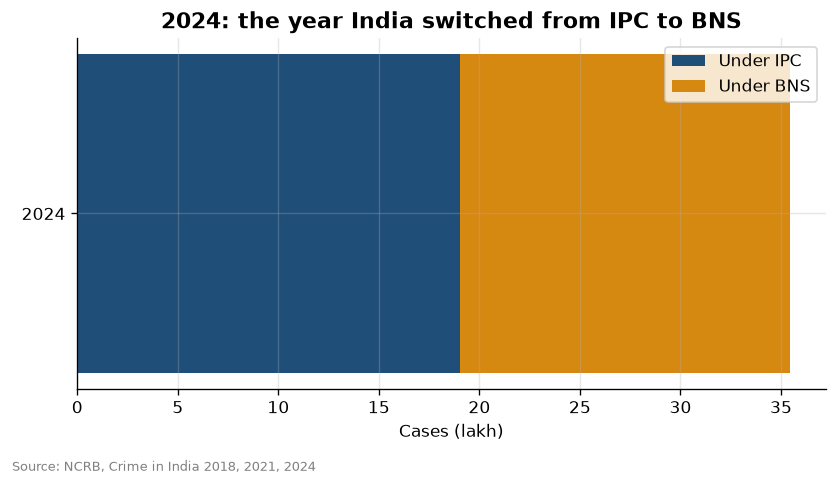
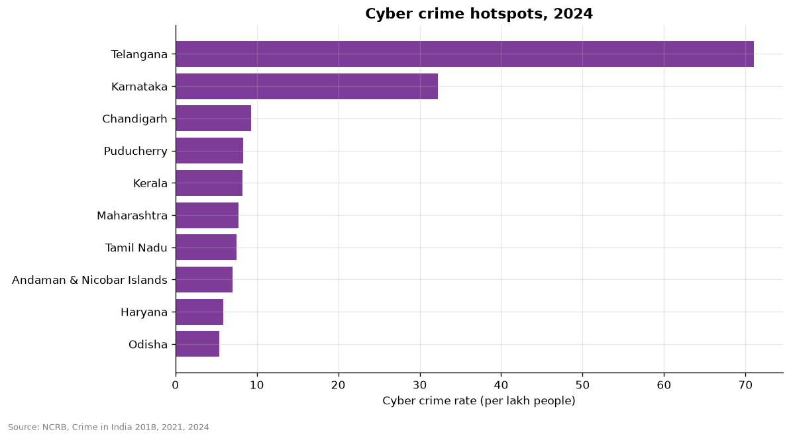

# Crime categories and the BNS transition

- Most common IPC/BNS crime head in 2024: Theft (621,945 cases).
- Most common SLL crime in 2024: Prohibition Act (State) (797,026 cases).
- 46.3% of 2024 IPC/BNS cases were registered under the new BNS, which applied only from 1 July 2024.
- BNS share varies by crime: highest for 'Sexual Intercourse by employing deceitful means' (100%), lowest for 'Simple Hurt' (0%). Crimes reported long after they happen stay under IPC, because the law at the time of the offence applies.
- Highest cyber crime rate in 2024: Telangana (71.1 per lakh). Top 3 states hold 59% of all cyber cases.

## Charts

