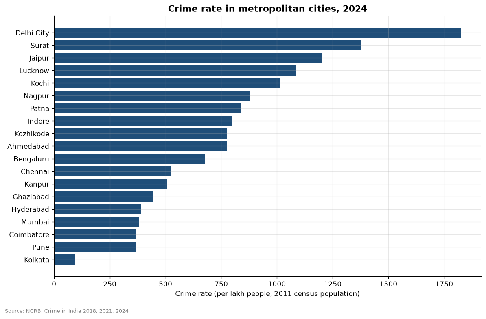
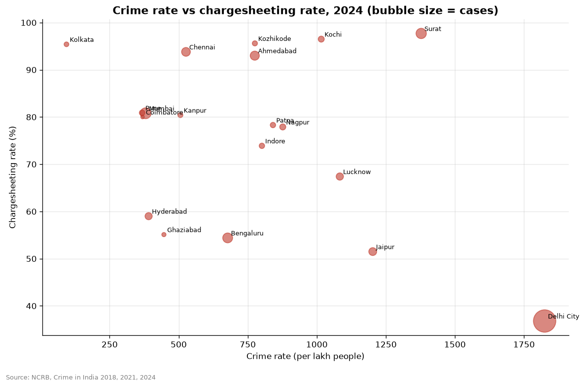

# Metropolitan cities

- Highest crime rate among metros in 2024: Delhi City (1824 per lakh); lowest: Kolkata (94).
- Largest rise in cases 2022-2024: Lucknow (+64.9%); largest fall: Indore (-36.0%).
- Correlation between crime rate and chargesheeting rate across metros: -0.33 (a noticeable relationship worth investigating).
- Caution: NCRB computes city rates with 2011 census population, so fast-growing cities look worse than they really are.

## Charts

