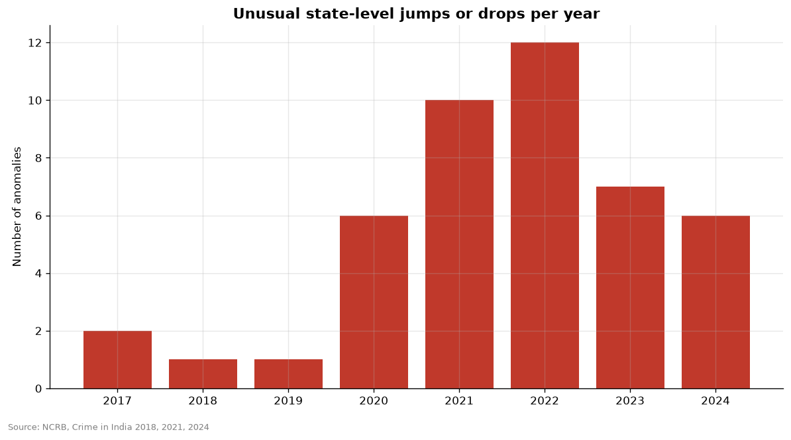

# Anomaly detection

- 45 anomalies found (|robust z| > 3.5, at least 500 cases). Full list: reports/insights/anomalies.csv.
- Manipur, Violent crimes, 2023: 631 -> 14,427 cases (+2186%, z = +27.1).
- Manipur, IPC/BNS crimes, 2023: 3,029 -> 19,192 cases (+534%, z = +20.4).
- Manipur, Total cognizable crimes (IPC/BNS + SLL), 2023: 3,914 -> 20,283 cases (+418%, z = +15.8).
- Manipur, IPC/BNS crimes, 2024: 19,192 -> 4,572 cases (-76%, z = -12.6).
- Manipur, Total cognizable crimes (IPC/BNS + SLL), 2024: 20,283 -> 5,284 cases (-74%, z = -12.2).
- Assam, Crimes against children, 2023: 4,084 -> 10,174 cases (+149%, z = +10.7).
- Tamil Nadu, IPC/BNS crimes, 2021: 891,700 -> 322,852 cases (-64%, z = -8.5).
- Tamil Nadu, IPC/BNS crimes, 2020: 168,116 -> 891,700 cases (+430%, z = +8.1).
- An anomaly is a question, not a conclusion: it can mean a real change in crime, a reporting or registration change, or a data error. Each one needs checking.

## Charts

